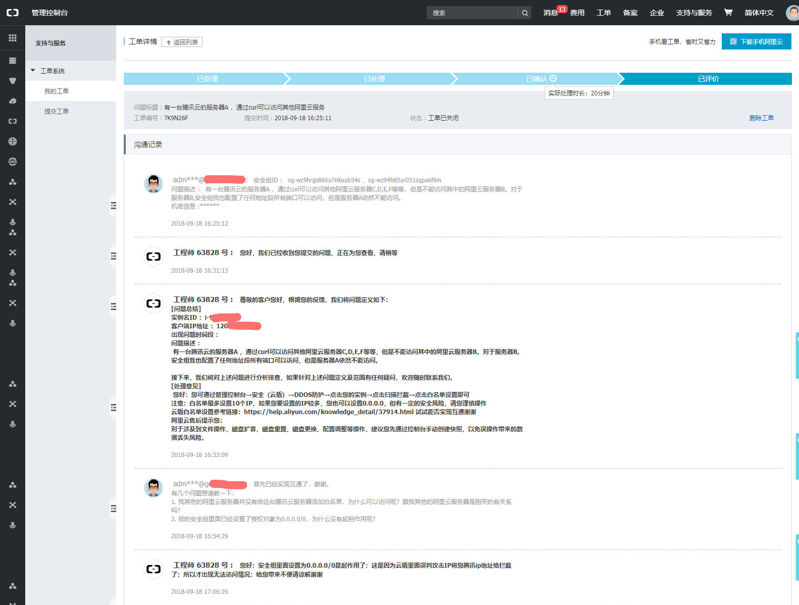

### 一、背景

​	由于一台装有Nginx的阿里云服务器到期，服务器配置最低配置（1核1G）加5M带宽，只安装了一个Nginx用作负载均衡和反向代理。本来直接续费啥事没有，这个配置续费一年也就1000多块，但是碰巧腾讯云送了一张10000的代金券（包年包月，可购新机，最多时长6个月）。嗯，想想不能浪费了，所以决定迁移这台服务器。迁移之前，公司所有的服务器都在阿里云这边。这个券最多买6个月，也就说6个月之后要么续，要么再次迁移，嗯老板们想事情，估计计算成本会比较多一些。。。。

​	公司对外的入口服务都是通过这个一台只装有Nginx的服务器。然后通过Nginx的反向代理，起到初步的安全过滤吧。整体实际上是个树形结构，其他服务器就放在这台服务器下面。

​	说了上面这一些，应该背景能够知道个大概了。

### 二、迁移

​	照理来说，迁移一台只装有Nginx的服务器，应该不肥吹灰之力就搞定了吧，但是世事难料啊，哪有那么顺利的事情，特别是软件行业。

迁移之前，预想的流程是：

1. 购买一台服务器，

2. 安装一个Nginx

3. 复制之前的Nginx的nginx.conf
4. 启动Nginx，搞定收工。
5. 测试。如预期，访问前面的服务都是正常的，心里不由的小开心起来，直到最后官网（“**问题服务器**”）的时候，有些文章内容不能展示。

### 三、排查

##### 路径一：

​	鼠标点击页面资源，响应页面提示：`520 Bad Gateway` 标准的Nginx错误页面。

​	Nginx日志：`*55 recv() failed (104: Connection reset by peer) while reading response header from upstream` 意思是，在获取后端服务器响应的时候，连接被重置。那么问题就应该是后端服务器的问题，但是没迁移之前，都是正常的呀，又找了一下是不是按照的Ngxin有问题，Google，Baidu一番之后：

找到下面这个一问一答，错误信息完全一样：

https://forum.nginx.org/read.php?2,250556

https://forum.nginx.org/read.php?2,250556,250576#msg-250576

证明问题不是Nginx的问题还是后端问题。

##### 路径二：

​	后端的“**问题服务器**”，直接通过IP是可以访问那些不能正常展示的资源。

这么看来后端服务器又是正常的呀。难道是域名映射的问题？

##### 路径三：

​	登录阿里云域名解析，嗯，域名解析也是正确的。

##### 路径四：

​	用其他服务器来访问“**问题服务器**”看看有没有问题？

​	通过其他服务器的命令窗口，通过curl访问“**问题服务器**”的资源，结果是正常返回

##### 结论：

​	新买的腾讯云服务器不能访问这台“**问题服务器**”

解决方案：修改这台服务器的安全组配置，保证其他服务器能够访问：

​		授权对象：0.0.0.0/0 端口范围：80/80

看到这里应该是可以了吧，结果还是不行，蓝瘦香菇啊，万念俱灰。

### 四、解决

​	最后使出云服务器的杀手锏----提工单

​	阿里云的工程师说的是设置白名单，腾讯云的那台服务器被拦截了，所以对于腾讯云的服务器，这个安全组的作用或许就不那么大了（摊手）

下面是工单记录：

​	